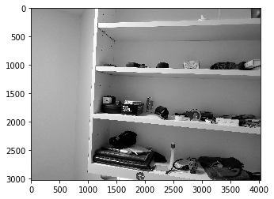
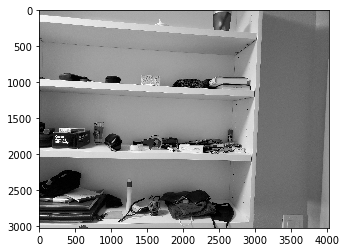
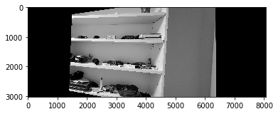
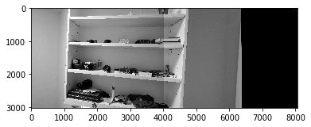
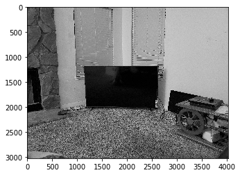
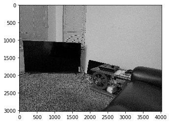
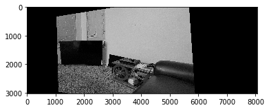
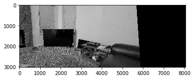
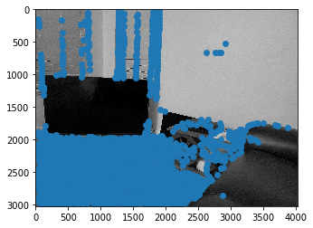

# Part A
## Digitizing Shelf Pictures and generating points

I took 2 pictures of my shelf at different angles:

After recovering the homography, I warped 1 shelf image using the homography to align with the second image 

I then added this warped image to the second image to obtain the mosaic.

## Mosaic with some more images

I performed a similar procedure with my TV setup as well

The warped image using the computed homography

The final mosaic

## What I learned
I noticed that my shelf mosaic has a dividing line between the 2 images that I was unable to get rid of while my TV image does not have a dividing line, which I thought was pretty interesting. It may be because my TV images have fewer distinct objects and slightly different lighting, due to which the dividing line was sufficiently blurred out.

# Part B
## 1. Detecting corner features in an image

Using the given starter code, I obtained the Harris corner points for  my TV image. I slightly modified the `get_harris_corners` function to use `corner_peaks` with a `min_distance=20` to get less points and have a clearer portrayal of the edges in the image. 

## What I learned

I was surprised to see so many Harris corner points and realized that choosing the most important points is very essential to properly automating the mosaic creation process.